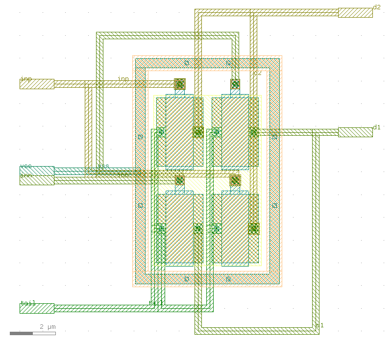

# layout/opamp_stage1: first-stage matched groups, increment 1 (input pair)

This is the first layout sub-block of `opamp_core` (issue #46). It holds the
NMOS differential input pair `XM1`/`XM2` from
`design/netlist/opamp_core.spice` (`sky130_fd_pr__nfet_01v8`, `W=6.03`,
`L=1.2`, `nf=1`, `m=1`). It is DRC clean on klt's curated sky130 deck and on
the PDK's own Magic `drc(full)` deck. It LVS matches a reference generated
from the netlist's own device cards, in both `klt lvs` and netgen.

**What it is not.** The PMOS mirror `XM3`/`XM4` is not here. Its DR-007
width, `W=4.634 um`, is not a multiple of sky130's 0.005 um manufacturing
grid, so no DRC-clean drawing of that width exists (see
[Why the PMOS mirror is not here](#why-the-pmos-mirror-is-not-here), tracked
in #50). This sub-block is not the op-amp's layout either. T1 item 2 stays
`unmet` and no manifest cites this directory.

## Result

| Step | Result | Evidence |
|---|---|---|
| `klt drc --deck sky130` | `status: "clean"`, `violation_count: 0` | `drc.json` |
| `klt extract --deck sky130` | `extracted`: 4 nfet units, 6 nets, 6 pins | `extract.json`, `opamp_stage1.spice` |
| `klt lvs` (subckt-call reference, `combine_devices`) | `status: "match"`: devices 2/2, nets 6/6, pins 6/6, `mismatch_count: 0`, `error_count: 0` | `lvs.json` |
| LVS negative control (`XM1` gate `inn` -> `inp`, scratch reference) | `status: "mismatch"`, `mismatch_count: 3` (2 `topology`, 1 `device.unmatched`), devices 1/2 and nets 2/6 matched | `negative-control/` |
| `compose-cell.py --check` | the rebuild is byte-identical: SHA-256 of `opamp_stage1.gds` and all 8 `gen/*.gds`, the generated reference text, and the verdict fields | run it |
| Magic 8.3.683 `drc(full)`, `sky130A.tech` | **0 errors**; types seen: `nmos ndiff ndiffc psubdiff psubdiffcont poly polycont locali viali metal1-3 via1-2 pwell` | `magic-signoff/magic.json` |
| netgen 1.5.133 + `sky130A_setup.tcl` (Magic extraction vs. the same reference) | `Netlists match uniquely.`; pins `inn inp tail d1 d2 vss` compared and equivalent (`port makeall` promotes the pin labels to ports before extraction) | `magic-signoff/netgen.out` |

Toolchain: klt `0.7.0+g4cbdfa769875` (git `4cbdfa76`), KLayout 0.30.12,
sky130A open_pdks `c6d73a35f524070e85faff4a6a9eef49553ebc2b`, klt deck
`sky130` content hash
`sha256:f8f2c3f48eada473dc34a7a8926c0b04fef446fb351a70a636ce43a9ca9c70ba`.
Top-cell GDS SHA-256:
`27b38f5114cd7cd30a812beac359ed08c53ca59490665cc1a020275465c28a96`.
`--check` was also re-run with klt installed into a throwaway venv from
`git+https://github.com/2AMLogic/klayout-tools@4cbdfa76`, rather than the
host install, and the result was byte-identical.

### Extracted devices against the netlist

| Netlist card | Extracted units (d / g / s / b) | Unit W x L | Total W |
|---|---|---|---|
| `XM1 d1 inn tail vss ... L=1.2 W=6.03` | `$1`, `$4`: d1 / inn / tail / vss | 3.015 x 1.2 | 6.03 |
| `XM2 d2 inp tail vss ... L=1.2 W=6.03` | `$2`, `$3`: d2 / inp / tail / vss | 3.015 x 1.2 | 6.03 |

Each netlist device is drawn as two parallel 3.015 um units, for the
common-centroid split. So extraction reports 4 devices and LVS reports
2/2 once `options.combine_devices` merges the parallel units. The driver
also checks this itself: it groups extracted units by terminal nets and
requires each group's summed W and common L to equal the card's W and L
exactly. `klt lvs` compares W exactly too. As a probe, a scratch reference
at W=6.031, 6.035, 6.04 or 6.1 against this layout returns `mismatch` (16
findings) every time.

### DRC coverage (quoted from `drc.json` `coverage`)

- `known: true`, `nothing_checked: false`, `unknown: []`, `skipped: []`.
- **61 rules checked**: `diff`/`tap`/`poly`/`licon1`/`li1`/`mcon`/`met1`/
  `via`/`met2`/`via2`/`met3` width, spacing (li1, mcon, met1-3, via, via2),
  enclosure, area, holes-area, angle and `*.ongrid.1`, plus
  `nsdm`/`psdm`/`npc` angle and on-grid checks.
- **75 rules `inapplicable`** (`no_applicable_geometry`), including every
  `nwell.*`, `dnwell.*`, `met4`/`met5`, `via3`/`via4` and capm rule.
- `layers_checked`: `65/20 65/44 66/20 66/44 67/20 67/44 68/20 68/44 69/20
  69/44 70/20 93/44 94/20 95/20`.
- `layers_in_stream_without_rules`: `67/5 68/5 69/5 70/5`, the pin-label
  text layers.

**What the curated deck cannot see, and why there is a second deck.** The
curated deck has no implant-enclosure, `npc`-enclosure, poly-endcap
(`poly.8`) or diffusion-extension (`poly.7`) rules, and the klt generators
draw none of those features on sky130. A first composition without the
`fe_masks` overlay (below) was `clean` on klt's deck and LVS `match`. On
Magic `drc(full)` the same GDS gave 12 error sites: `poly.8` at every gate
end, plus `nwell`/`diff/tap.8`/`LU.3`/`poly.7`. Those arise because Magic
reads implant-less diffusion as p-diffusion and the devices as `pmos`.
netgen did not match. That probe was a scratch run and is not committed;
re-run it with `magic-signoff.py` on a copy of `cell.json` without the
`fe_masks` block. `layout/bin/magic-signoff.py` makes the PDK's Magic deck
a second, independent check of the committed GDS. Before it trusts a zero
error count, it requires Magic to see `nmos ndiff psubdiff poly`. Magic's
`gds flatglob` was found to produce an empty top cell on these streams, a
vacuous pass the guard exists to catch.

Neither deck is a substitute for a foundry signoff run. Magic `drc(full)` is
the open_pdks reference deck, but antenna, density and latch-up rules at
chip level are out of scope for a sub-block.

## Matching style and placement

One `klt gen diff_pair` block (`splits: 2`, `gate_contact: true`,
`add_guard_ring: true`). The units form a 2 x 2 common-centroid
cross-quad. Coordinates are in um, in the cell frame:

```
            col 0 (diff x 0..2.04)    col 1 (diff x 2.44..4.48)
 row 1      XM2 unit (Q2_2)           XM1 unit (Q1_2)        diff y 4.235..7.25, gate pads y 7.86
 row 0      XM1 unit (Q1_1)           XM2 unit (Q2_1)        diff y 0..3.015,    gate pads y 3.625
            S x=0.21 D x=1.83          S x=2.65 D x=4.27     gates x 0.42..1.62 / 2.86..4.06 (L=1.2)
```



- **Common centroid.** Each device's two units sit on opposite diagonals,
  so both devices have their centroid at the array centre in x and y. A
  linear process gradient in either direction cancels to first order.
- **Same orientation.** All four units are drawn identically, with no
  mirroring: source on the west, drain on the east, gate pad on the north,
  in every unit. Gate shadowing and tilt-implant asymmetry are common to
  both devices.
- **Equal length and unit count.** Both devices are 2 units of
  3.015 x 1.2 um, which follows DR-002/DR-007's rule that matched devices
  share one length and differ only in unit count. Here the counts are equal.
- **Guard ring and taps.** The generator's p-tap ring encloses the quad
  with a 0.5 um padding (outer box -0.92..5.40 x -0.92..8.99). Its four taps
  form one ring conductor, strapped on li1 from `TAP_W` to the `vss` pin.
  That ring is the substrate/body contact, and every unit's body extracts
  as `vss`. Magic reads it as `psubdiff`/`psubdiffcont`.
- **Front-end masks (`fe_masks`, one `klt draw` overlay in the pair's own
  frame):**
  - `nsdm` over all four diffusions, with 0.125 um enclosure.
  - A `psdm` ring over the tap ring, with 0.125 um enclosure.
  - `npc` over each gate licon, with 0.1 um enclosure.
  - 0.15 um poly endcaps along the full gate width at both ends of every
    gate. sky130 `poly.8` requires 0.13 um.

  The overlay is symmetric over the four units, so it does not bias the
  match.
- **No dummies.** `diff_pair` has no dummy-device option. The outer units
  see the guard ring, not an identical neighbour, on their outer sides.
  The ring is symmetric about the array centre, so this is common to both
  devices, but the edge units are not shielded the way dummy columns would
  shield them.

### Routing and pins

The cross-quad's two diagonals make `d1`/`d2` and `inn`/`inp` inherently
crossing pairs. Each pair is therefore split across two routing planes:

| Net | Plane | Path |
|---|---|---|
| `tail` | met1 | vertical strap on each source column (x=0.21, x=2.65) through both rows, joined below the ring at y=-2.0 |
| `d1` | met2 | `XM1` row-0 drain south to y=-3.0, east to x=7.0, north to the row-1 drain's track (y=5.74), to the east pin |
| `d2` | met3 | both `XM2` drains north to y=11.0, east to the pin |
| `inn` | met2 | inner gate west to x=-2.5, north to y=10.0, east and down to the outer gate |
| `inp` | met3 | inner gate west to x=-3.0, north to the outer gate's track (y=7.86) |
| `vss` | li1 | `TAP_W` west to the pin |

Every boundary net ends on a `klt draw` stub (1.5 x 0.42 um on the net's
own routing layer) at the cell edge. Its `PAD` is promoted through
`pins[]`. West edge: `tail`, `inn`, `vss`, `inp`. East edge: `d1`, `d2`.
`compose.response.json` `ports[]` lists exactly `inn inp tail d1 d2 vss`;
the driver fails if any LVS pin is not a composed-cell port or is not a
named net in the extraction. Each label sits on its stub's own metal
(`67/5`/`68/5`/`69/5`/`70/5`), and `klt extract` recovers all six net
names from them.

**The routing is not symmetric.** Only the devices are matched. `d1`
loops south and east while `d2` runs north, and the two gate routes have
different lengths and layers. The two halves therefore see unequal
wiring capacitance and resistance. LVS cannot see that. Parasitic
extraction of this block (out of scope here) is the check that would
quantify it. A symmetric two-plane trunk is a candidate improvement once
the PMOS mirror shares the floorplan.

## Why the PMOS mirror is not here

Any drawn device width is the distance between two on-grid diffusion
edges. On sky130 that is a multiple of 0.005 um for any finger or split
arrangement. 4.634 is not a multiple of 0.005. Probes with the same pinned
flow:

- `mos_array` pfet W=4.634: 18 `*.ongrid.1` violations. Extraction still
  reports 4.634, so extract alone would not catch it.
- `diff_pair` mirror pfet W=4.635 (splits 1) and W=2.32 x 2: DRC clean.
- W=2.317 x 2: 90 `*.ongrid.1` violations.

Because LVS is width-exact (see above), drawing a rounded width would
fail LVS against the netlist. Loosening the LVS tolerance would only hide
the discrepancy. The fix is a sizing decision in `design/` with a
decision record in `spec/`, which #46 may not touch. It is tracked in #50,
which also records that `XMB1`/`XM5`/`XM7`'s W=7.819 is off-grid the same
way. Once #50 lands, the PMOS mirror joins this cell as a `cell.json`
change: add `XM3`/`XM4` to `lvs.devices` and `vdd` to `lvs.pins`, then add
a mirror-flavoured `diff_pair` block, its `fe_masks` (psdm over p-diff,
nsdm over the n-tap ring) and its routes.

## klt gaps hit (friction protocol)

| Gap | Filed | Effect here / workaround |
|---|---|---|
| `gen-compose` centres via-drop stacks on off-grid port midpoints (odd-grid-multiple pads) | 2AMLogic/klayout-tools#2932 | The first compose had 134 findings (133 `*.ongrid.1`). `snap_ports_to_grid_um: 0.005` moves each attach point at most 0.0025 um, inside its own pad. Moves are recorded in `gen/mn12.snapped.gen.json` `_snapped_ports`, and the unmodified report stays in `gen/mn12.gen.json`. |
| `gen` silently accepts a `w_um` not representable on the grid | 2AMLogic/klayout-tools#2933 | The PMOS mirror can't be drawn (see above). |
| sky130 generators draw no `nsdm`/`psdm`/`npc`, and the curated deck can't see it | 2AMLogic/klayout-tools#2934 | Drawn by hand in `fe_masks`. Checked with Magic. |
| sky130 unit-device gate poly has no endcap (`poly.8`), and the curated deck can't see it | 2AMLogic/klayout-tools#2936 | Endcaps drawn in `fe_masks`. Checked with Magic. |
| `gen-compose` response records `blocks[].cell` `source_path` as absolute | 2AMLogic/klayout-tools#2935 | The driver strips the output-directory prefix before writing `compose.response.json`. |

## Reproduce

```
python3 layout/bin/compose-cell.py layout/opamp_stage1/cell.json            # regenerate in place
python3 layout/bin/compose-cell.py layout/opamp_stage1/cell.json --check    # byte-exact rebuild check
python3 layout/bin/compose-cell.py layout/opamp_stage1/cell.json --negative-control XM1:g=inp
python3 layout/bin/magic-signoff.py layout/opamp_stage1/cell.json           # Magic DRC + netgen LVS
```

See `layout/README.md` for the pinned toolchain and a throwaway-venv
recipe.

## Files

- `cell.json` is the recipe: blocks, `fe_masks`, placement, routing, pins
  and the LVS device selection.
- `gen/`: per-block `klt gen`/`klt draw` requests, responses and streams.
- `compose.request.json`, `compose.response.json`: `klt gen-compose`.
- `opamp_stage1.gds` is the composed cell (GDS timestamps are zero).
- `drc.json`, `extract.json`, `opamp_stage1.spice`: klt DRC report,
  extraction report and extracted netlist.
- `opamp_stage1.ref.spice` is the generated LVS reference (cards `XM1`,
  `XM2` copied verbatim from `design/netlist/opamp_core.spice`).
- `lvs.request.json`, `lvs.json`: the passing klt LVS run.
- `negative-control/`: the scratch reference with one gate rewired, its
  request and the `mismatch` response. It never overwrites the files above.
- `magic-signoff/`: Magic DRC/extraction summary (`magic.json`), the
  Magic-extracted netlist and the netgen report.
- `overview.png`: `klt render` overview, for orientation only (not part of
  `--check`).
